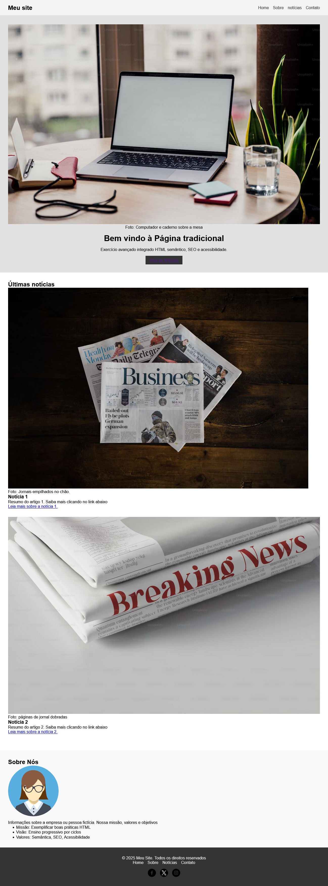

# 📘 Projeto M1 · P1 · N5 — Página Tradicional

Este projeto faz parte do **Módulo 1 – Fundamentos**, Nível 5, do tipo **P1 – Exercício Tradicional**.  
O objetivo foi criar uma **página robusta** aplicando HTML semântico, SEO básico e princípios de acessibilidade, consolidando todo o aprendizado do módulo.

---

## 🎯 Objetivos do Nível 5

- Integrar todos os conteúdos dos níveis anteriores.
- Criar uma página completa com header, nav, main e footer.
- Usar tags semânticas corretamente (`section`, `article`, `figure`, `figcaption`).
- Implementar SEO básico (`meta description`, títulos hierárquicos, alt em imagens).
- Garantir acessibilidade mínima (texto alternativo e navegação clara).
- Produzir um layout consistente com CSS (flexbox, espaçamento, responsividade básica).

---

## 📂 Estrutura do Projeto

M1N1P5/
│── index.html
│── css/
│ └── style.css
│── img/
│ ├── img1.png
│ ├── img2.png
│ ├── img3.png
│ └── icons/
│ ├── facebook.png
│ ├── twitter.png
│ └── instagram.png

---

## 🖥️ Tecnologias utilizadas

- **HTML5**
- **CSS3 (Flexbox, reset básico)**

---

## 📌 Funcionalidades

- **Header fixo** com logo e menu de navegação.
- **Hero/banner** com imagem de destaque, título e botão de ação.
- **Seção de notícias** com artigos, imagens, legendas e links.
- **Seção "Sobre"** com informações institucionais (missão, visão e valores).
- **Footer** com direitos autorais, navegação duplicada e links de redes sociais.

---

## ✅ Melhorias futuras

- Tornar os links de “Leia mais” mais específicos para cada artigo.
- Melhorar a descrição dos textos alternativos (`alt`) nas imagens.
- Adicionar efeitos visuais (hover/focus) para aumentar a interatividade.
- Refinar o uso de `<figure>` (limitar ao que realmente precisa de legenda).

---

## 📸 Prints da Página

---

## 📑 PDFs

Todos os PDFs relacionados a este projeto estão na pasta `docs/`:

- [guia-mx-px-nx.pdf](docs/guia.pdf)

## 🏁 Conclusão do Módulo 1

Com este projeto, o **Módulo 1 – Fundamentos** foi concluído.  
Durante os cinco níveis, o aprendizado evoluiu de **estruturas simples** até a **construção de uma página completa e funcional**.

Principais conquistas do módulo:

- Compreensão do **HTML semântico**.
- Uso inicial de **CSS para layout básico**.
- Primeiros passos em **SEO e acessibilidade**.
- Desenvolvimento de **boas práticas de organização de código**.

👉 O fechamento deste módulo mostra que a base foi consolidada e que já é possível estruturar páginas web de forma clara e profissional.  
Agora o próximo passo é o **Módulo 2**, onde o foco será refinar, organizar melhor os layouts e explorar novas técnicas.
